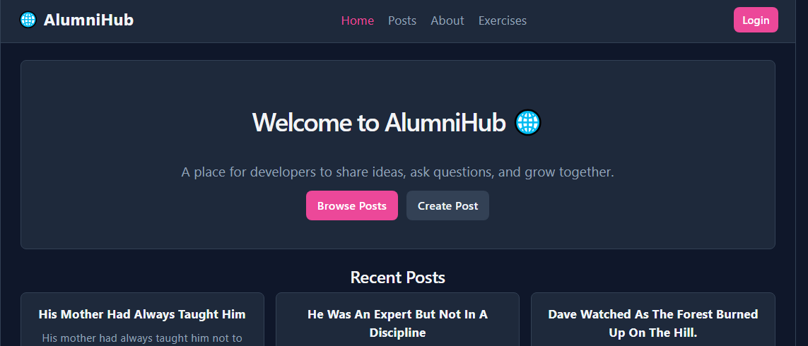
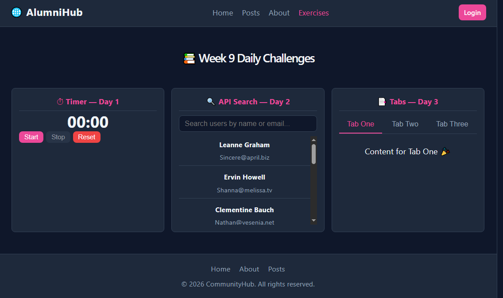

# Week 9: React Advanced

## Author
- **Name:** Connie
- **GitHub:** [@Connie-cloud-svg](https://github.com/Connie-cloud-svg)
- **Date:** May 06, 2026

## Project Description
An upgraded version of AlumniHub built with advanced React concepts. Week 9 transforms the Week 8 static frontend into a fully multi-page application with real API data, custom hooks, React Router navigation, protected routes, and persistent login state. Posts are fetched live from the JSONPlaceholder API, and the app behaves like a real community platform with multiple pages, comments, user profiles, and form validation.

## Technologies Used
- React 18
- Vite
- React Router DOM v6
- JavaScript (ES6+)
- CSS3 (custom properties / CSS variables)
- JSX
- JSONPlaceholder REST API
- localStorage (via custom hook)

## Features
- Multi-page navigation with React Router — Home, Posts, Post Detail, Create Post, About, Profile
- Real posts and comments fetched from JSONPlaceholder API using a custom `useFetch` hook
- Click any post to view its full detail page with live comments
- Search and filter posts by title or content
- Create Post form with field validation using a custom `useForm` hook
- Login system with username persisted across page refreshes via `useLocalStorage`
- Protected routes — `/create` and `/profile` redirect to login if not signed in
- Active navigation link highlighting with React Router's `NavLink`
- Loading spinner and error message components for all API requests
- Tabbed User Profile page fetching posts and todos per user
- Daily challenge exercises — Timer with `useEffect` cleanup, debounced API Search, and reusable Tabs component
- Dark theme with pink accents carried over from Week 8
- 404 Not Found page for unmatched routes

## How to Run
1. Clone this repository
   ```bash
   git clone https://github.com/Connie-cloud-svg/iyf-s10-week-09-Connie-cloud-svg.git
   ```
2. Navigate into the project folder
   ```bash
   cd iyf-s10-week-09-Connie-cloud-svg
   ```
3. Install dependencies
   ```bash
   npm install
   ```
4. Install React Router
   ```bash
   npm install react-router-dom
   ```
5. Start the development server
   ```bash
   npm run dev
   ```
6. Open your browser and go to `http://localhost:5173`

## Lessons Learned
- How `useEffect` works — when it runs, what the dependency array controls, and why cleanup functions matter (clearing intervals, cancelling fetches)
- How to build custom hooks — extracting reusable logic like `useFetch`, `useLocalStorage`, `useForm`, and `useToggle` so components stay clean and focused
- How React Router DOM works — setting up `BrowserRouter`, `Routes`, `Route`, using `Link` and `NavLink`, reading URL params with `useParams`, and redirecting with `useNavigate`
- The difference between calling `setState` inside an effect vs deriving values directly during render — learned this by fixing an ESLint warning in `ApiSearch.jsx`
- How to build protected routes that redirect unauthenticated users without a backend
- How `localStorage` can persist state across page refreshes using a custom hook

## Challenges Faced
- **setState inside useEffect ESLint error** — the `ApiSearch` component originally filtered users by calling `setUsers()` inside a `useEffect`, which ESLint flagged as causing cascading renders. Fixed by removing the `users` state entirely and computing the filtered list directly during render from a `debouncedQuery` state value instead.
- **Login not persisting on refresh** — the initial `isLoggedIn` state was just `useState(false)`, so refreshing the page always logged the user out. Fixed by switching to the custom `useLocalStorage` hook which reads from and writes to `localStorage` automatically.
- **NavLink active styles not applying** — `NavLink` requires a className function `({ isActive }) => isActive ? 'active' : ''` rather than a plain string, which was different from regular `Link` usage.

## Screenshots


